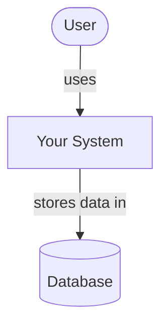
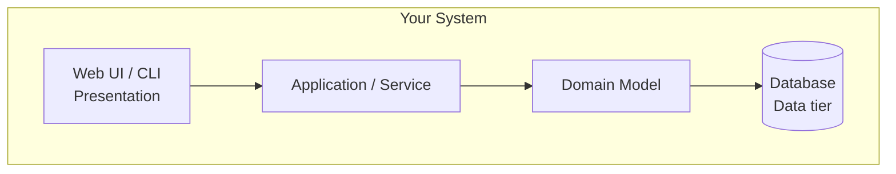
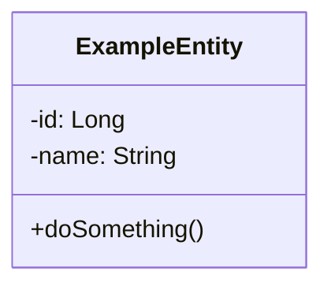
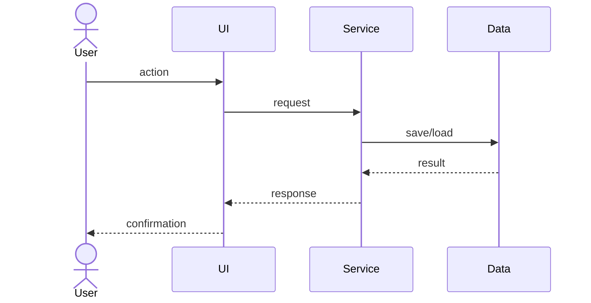

# Personal Finance Advisor

<!-- CI badge: after Session 4, replace ORG/REPO and the workflow filename, then uncomment:

-->

**Student:** Jesse Trueba · **Course:** CEN 5064 Software Design, Fall 2026 · **Partner:** @esway001

## Project 

My project will be a personal finance advisor web application designed to help users better understand and manage their money. The system will allow users to record and categorize income and expenses, create monthly budgets and compare their spending against those budgets, set savings goals and track their progress, and view a financial dashboard that summarizes their overall financial activity through balances, spending categories, and other useful information. The goal of the project is to provide a simple and organized way for users to monitor their finances while demonstrating a clear software architecture and well-designed separation between the user interface, business logic, domain objects, and data storage.

## How to run

```
[Exact commands to build and run your system from a clean clone.
Update this every time the steps change — your partner and your
instructor will follow it literally on conference days.]
```

## Architecture

### Tier breakdown (Session 2 studio)

| Tier | Responsibilities in THIS system |
|------|--------------------------------|
| Presentation | Displays the financial dashboard and forms for entering transactions, budgets, and savings goals. Collects user input and shows results returned by the Service tier. Likely modules: DashboardPage, TransactionForm, BudgetGoalPage. |
| Service | Coordinates the main use cases of the application, such as adding a transaction, creating a budget, and updating a savings goal. It connects the Presentation tier with the Domain and Data tiers. Likely modules: TransactionService, BudgetService, SavingsGoalService. |
| Domain | Contains the main financial entities and business rules. This includes representing transactions, comparing spending against a budget, and calculating progress toward a savings goal. Likely classes: Transaction, Budget, SavingsGoal. |
| Data | Handles saving and retrieving transactions, budgets, and savings goals from the application's single data store. The rest of the system should not need to know how the data is physically stored. Likely modules: TransactionRepository, BudgetRepository, SavingsGoalRepository. |

### C4 — Context & Container (Session 3 studio)





### UML — Class & Sequence (Session 3 studio)





## Architecture Decision Records

Decisions live in [`docs/adr/`](docs/adr/). Start with ADR-001 in Session 4.

| # | Decision | Status |
|---|----------|--------|
| [001](docs/adr/adr-001.md) | [What I am building and why] | [proposed] |

## Weekly log (optional but recommended)

A one-line note per week keeps your commit story readable:

- Week 1 (Aug 24): repo created, three ideas drafted
- Week 2 (Aug 31): ...
