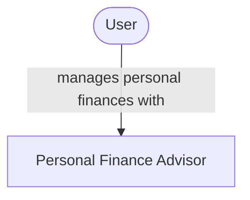
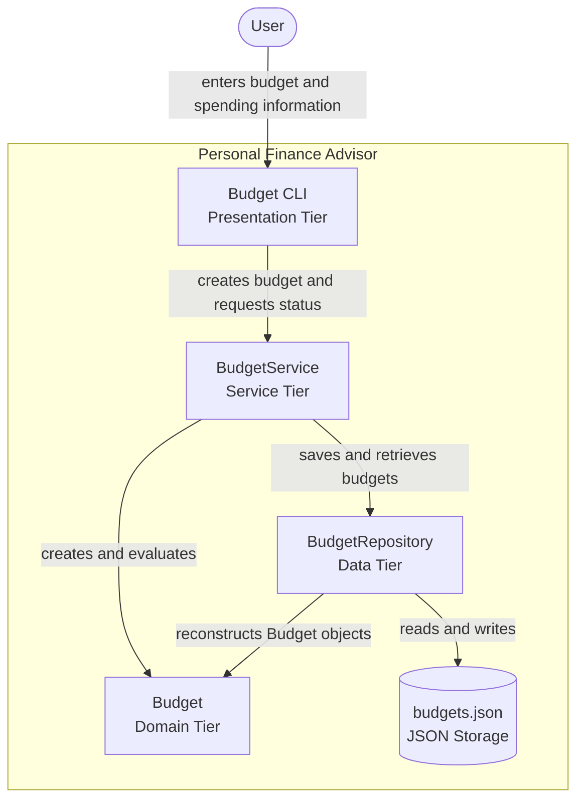
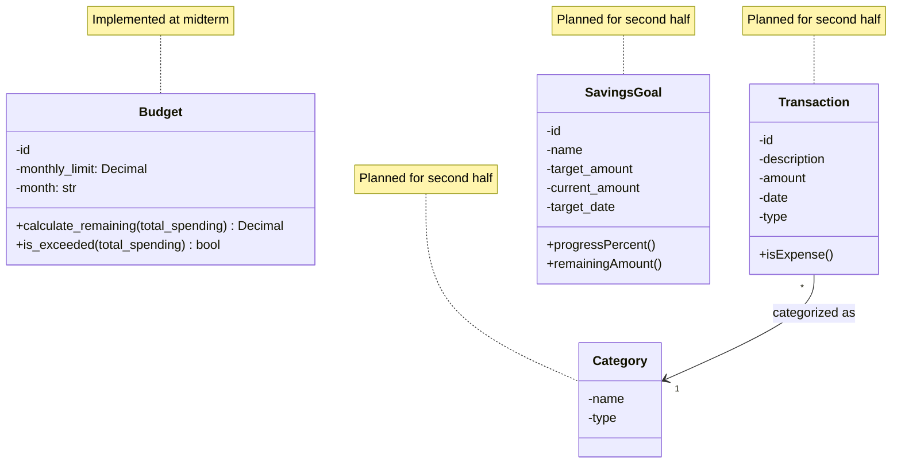
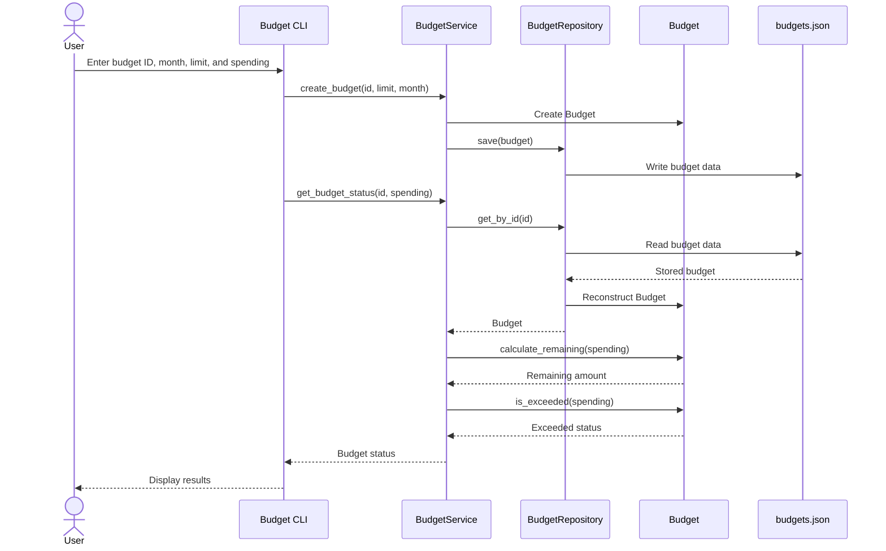

# Personal Finance Advisor
[](https://github.com/Jesse-Trueba/cen5064-project-trueba/actions/workflows/ci.yml)

<!-- CI badge: after Session 4, replace ORG/REPO and the workflow filename, then uncomment:

-->

**Student:** Jesse Trueba · **Course:** CEN 5064 Software Design, Fall 2026 · **Partner:** @esway001

## Project 

My project will be a personal finance advisor web application designed to help users better understand and manage their money. The system will allow users to record and categorize income and expenses, create monthly budgets and compare their spending against those budgets, set savings goals and track their progress, and view a financial dashboard that summarizes their overall financial activity through balances, spending categories, and other useful information. The goal of the project is to provide a simple and organized way for users to monitor their finances while demonstrating a clear software architecture and well-designed separation between the user interface, business logic, domain objects, and data storage.

## How to Run

### Requirements

- Python 3.12 or newer

### Install dependencies

```bash
python -m pip install -r requirements.txt
python -m pip install pytest ruff
```

### Run the tests

```bash
python -m pytest
```

### Run the budget working slice

```bash
python -m presentation.budget_cli
```

When prompted, enter:

- a budget ID
- a month in YYYY-MM format
- a monthly budget limit
- a total spending amount

The program will save the budget, retrieve it from storage, calculate the remaining amount, determine whether the budget has been exceeded, and display the result.

## Architecture

### Tier breakdown (Session 2 studio)

| Tier | Responsibilities in THIS system |
| --- | --- |
| Presentation | Collects budget information from the user and displays budget status through `presentation/budget_cli.py`. |
| Service | `BudgetService` coordinates budget creation and budget-status use cases between the Presentation, Domain, and Data tiers. |
| Domain | `Budget` contains the financial business rules for calculating the remaining budget and determining whether spending exceeds the monthly limit. |
| Data | `BudgetRepository` saves and retrieves budget information using JSON storage in `data/budgets.json`. |

### C4 — Context & Container (Session 3 studio)


```mermaid
flowchart TB
    user([User]) -->|manages personal finances with| system[Personal Finance Advisor]
```


```mermaid
flowchart TB
    user([User])

    subgraph FinanceAdvisor [Personal Finance Advisor]
        presentation[Budget CLI<br/>Presentation Tier]
        service[BudgetService<br/>Service Tier]
        domain[Budget<br/>Domain Tier]
        repository[BudgetRepository<br/>Data Tier]
        json[(budgets.json<br/>JSON Storage)]
    end

    user -->|enters budget and spending information| presentation
    presentation -->|creates budget and requests status| service
    service -->|creates and evaluates| domain
    service -->|saves and retrieves budgets| repository
    repository -->|reads and writes| json
    repository -->|reconstructs Budget objects| domain
```

### UML — Class & Sequence (Session 3 studio)


```mermaid
classDiagram
    class Budget {
        -id
        -monthly_limit: Decimal
        -month: str
        +calculate_remaining(total_spending) Decimal
        +is_exceeded(total_spending) bool
    }

    class Transaction {
        -id
        -description
        -amount
        -date
        -type
        +isExpense()
    }

    class Category {
        -name
        -type
    }

    class SavingsGoal {
        -id
        -name
        -target_amount
        -current_amount
        -target_date
        +progressPercent()
        +remainingAmount()
    }

    Transaction "*" --> "1" Category : categorized as

    note for Budget "Implemented at midterm"
    note for Transaction "Planned for second half"
    note for Category "Planned for second half"
    note for SavingsGoal "Planned for second half"
```


```mermaid
sequenceDiagram
    actor U as User
    participant UI as Budget CLI
    participant S as BudgetService
    participant R as BudgetRepository
    participant B as Budget
    participant J as budgets.json

    U->>UI: Enter budget ID, month, limit, and spending
    UI->>S: create_budget(id, limit, month)
    S->>B: Create Budget
    S->>R: save(budget)
    R->>J: Write budget data

    UI->>S: get_budget_status(id, spending)
    S->>R: get_by_id(id)
    R->>J: Read budget data
    J-->>R: Stored budget
    R->>B: Reconstruct Budget
    R-->>S: Budget

    S->>B: calculate_remaining(spending)
    B-->>S: Remaining amount
    S->>B: is_exceeded(spending)
    B-->>S: Exceeded status

    S-->>UI: Budget status
    UI-->>U: Display results
```

## Architecture Decision Records

Decisions live in [`docs/adr/`](docs/adr/). Start with ADR-001 in Session 4.

| # | Decision | Status |
|---|----------|--------|
| [001](docs/adr/adr-001.md) | [What I am building and why] | [proposed] |

## Weekly Log

### Week 1 — Aug. 24–30
- Set up the GitHub repository from the course template.
- Defined the Personal Finance Advisor project scope and core features.
- Established the initial four-tier architecture.

### Week 2 — Aug. 31–Sept. 6
- Refined the README and tier breakdown.
- Identified Presentation, Service, Domain, and Data responsibilities.
- Continued planning the project's core classes and features.

### Week 3 — Sept. 7–13
- Refined project requirements and use cases.
- Prepared the architecture for the upcoming C4 and UML design work.

### Week 4 — Sept. 14–20
- Added the C4 Context and Container diagrams.
- Added the UML class diagram.
- Added a sequence diagram showing a core system workflow.

### Week 5 — Sept. 21–27
- Began using the issue → branch → commit → pull request → review → merge workflow.
- Created GitHub issues with acceptance criteria for the project's main features.
- Participated in peer pull-request reviews.

### Week 6 — Sept. 28–Oct. 4
- Used the AI-assisted development workflow to implement the Budget domain logic.
- Added automated tests for remaining-budget and exceeded-budget calculations.
- Identified and corrected issues in AI-generated code through verification and peer review.

### Week 7 — Oct. 5–11
- Added and verified the Python CI workflow with Ruff and pytest.
- Added two Architecture Decision Records (ADRs).
- Created and updated the GitHub project board.
- Implemented the end-to-end budget working slice through Presentation, Service, Domain, and Data tiers.
- Added JSON persistence and working-slice tests.
- Updated README run instructions and architecture diagrams for the midterm.
